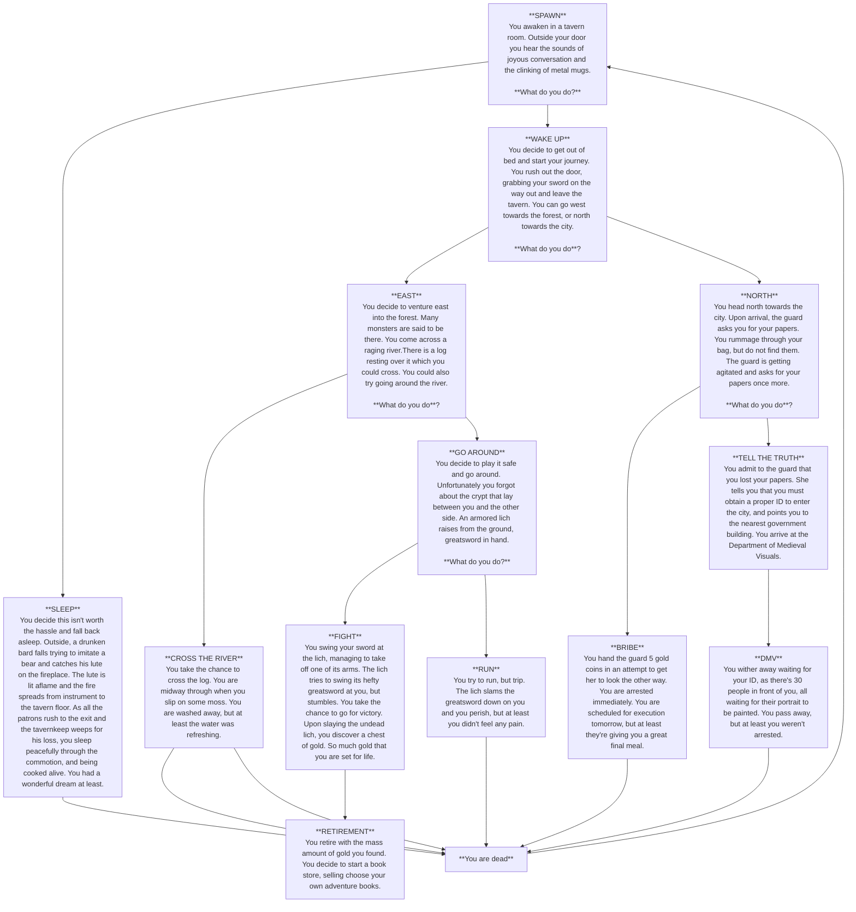

### Documentation

> This is a choose-your-own adventure story! I used a flow chart to create a dialogue tree to create the branching paths the reader could choose. Each entity is pretty self explanatory and is a piece of narrative used as part of the whole tree. Each piece on it's own doesn't make much sense, but the whole comes together to form a little story the reader can interact with.

>Each dialogue option gives significance by directly impacting the next branches. For example, choosing to wake up versus staying asleep marks either the continuation of the story or its abrupt end. Each entity supports the entire narrative by each being a core part of the dialogue tree.
